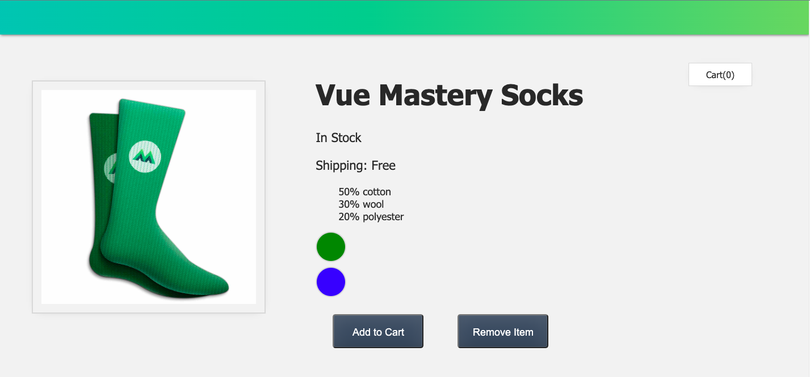
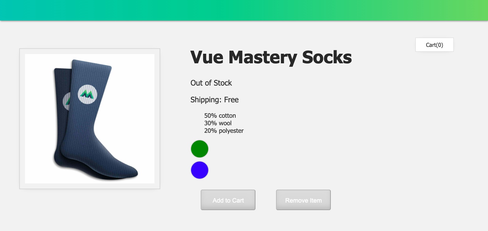
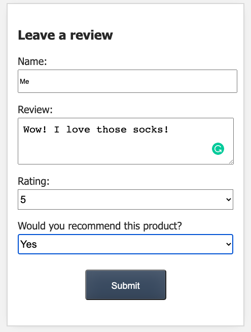
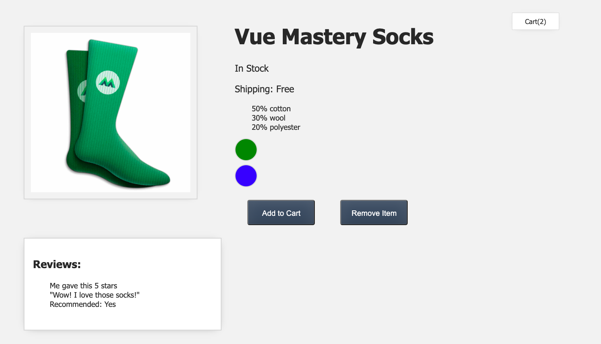

# Intro-to-Vue-3-Code-Challenges-Solutions

Initial code for Vue Mastery's Intro to Vue 3 course.
Source: https://www.vuemastery.com/courses/intro-to-vue-3

## Project finished

Product in Stock Screen

Product in Out of Stock Screen

Review Form

Product Page with review and cart info

## Step Lessons

- Lesson 1 - Intro to Vue 3

  - No code challenge

- Lesson 2 - Creating the Vue App

  - Code Challenge L2: Add a product description to the data object and display the description using an expression in a p tag.

- Lesson 3 - Attribute Binding

  - Code Challenge L3: Add a url to the data object and Bind the url to an anchor tag’s href attribute.

- Lesson 4 - Conditional Rendering

  - Code Challenge L4: Add an onSale boolean to the data obj and use that to conditionally render a p tag that says "on Sale" whenever the onSale is true.

- Lesson 5 - List Rendering

  - Code Challenge L5: Add an array of sizes to the data object and use v-for to display them in a list.

- Lesson 6 - Event Handling

  - Create a new button that decrements the value of cart.

- Lesson 7 - Class and Style Binding

  - Bind the out-of-stock-img class to the image whenever inStock is false.

- Lesson 8 - Computed Properties

  - Add an onSale boolean to the data. Use a computed property to display the string: ’brand + ’ ’ product + ’ ’ is on sale’, whenever onSale is true.

- Lesson 9 - Components & Props

  - Create a new component called 'product-details', which receives the details through a prop called details.

- Lesson 10 - Comunicating Events

  - Add a new button to product-display, which removes the product from the cart.

- Lesson 11 - Forms & v-model

  - Add a question to the review-form: 'Would you recommend this product? '. Record and emit the response, and display it within review-list
